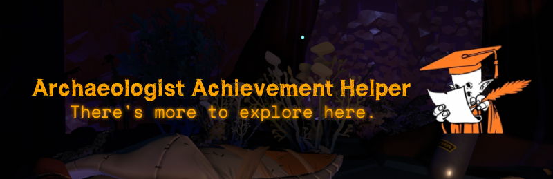
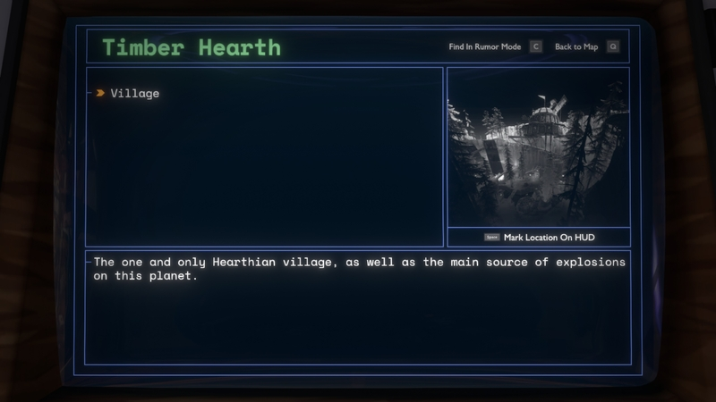
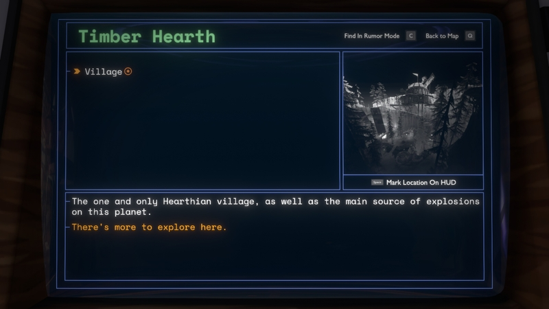
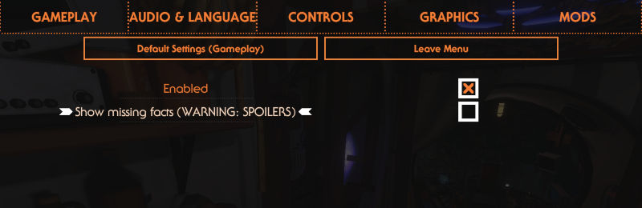
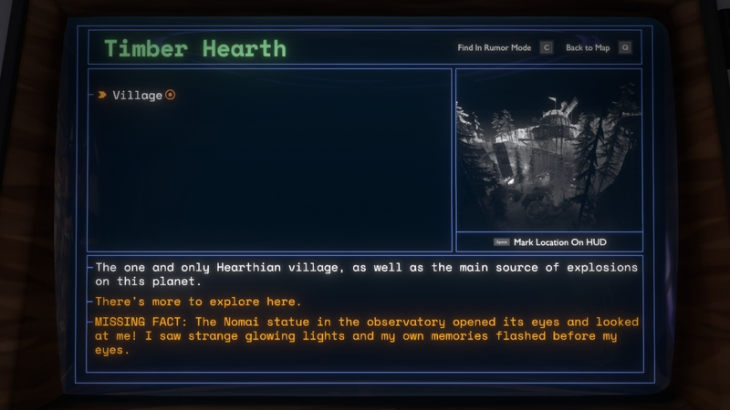

# Archaeologist Achievement Helper by Damián Garro

Marks ship log entries that have missing facts required for the Archaeologist achievement as *"There's more to explore here."*. It also lets you view which facts you haven't revealed!

## Basic usage

In Outer Wilds, when an entry **isn't** displayed as *"There's more to explore here."* it doesn't mean that all of its facts are revealed, there are some facts that don't affect that mark, and some of them are even required for the Archaeologist achievement. For example, the Timber Hearth Village entry has 2 facts that are needed for the achievement, but this entry is never marked as *"There's more to explore here."*:

This makes it difficult to know where to find the facts that you are missing for the achievement. The Archaeologist Achievement Helper mod forces *"There's more to explore here."* to appear if there is at least one unrevealed fact that is required for Archaeologist:

This feature helps you know in which entries there may be missing facts that you need for the achievement.

## Show all missing facts feature

If you need even more help, you can activate a setting to show all unrevealed facts that Archaeologist requires:

When you activate it the missing facts are shown like this (below the *"There's more to explore here."* text, with the same color and starting with *"MISSING FACT: "*):

**Beware of spoilers**, only activate this option if you already beat the game, as this could reveal something important you don't know, although if you are using this mod you probably won the game and you are chasing the achievements.

If even with this option you are still unable to find the missing facts, I suggest going to the [Outer Wilds unofficial Discord server](https://discord.gg/kChJgBMmtd) and asking for help in `#archaeologist-achievement` channel (please remember to let them know which facts you have missing).

The site [outerwilds.ventures](https://outerwilds.ventures/) is also a great resource you can use to complete your entries!